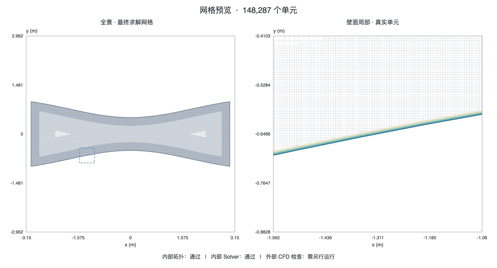

# CartMesh2D

原生二维笛卡尔网格生成器，提供 **macOS、Windows、Linux 桌面应用**和命令行工具。导入二维轮廓或 PNG/JPG 图片，设置网格数量或相对尺寸，生成真实 Cut-cell / 贴体边界层网格，并导出 OpenFOAM case。

当前桌面版本 **0.3.0**，定位为有明确支持范围的工程验证版。固定圆柱、翼型、喷管已生成十万级网格；任意复杂几何的鲁棒性、网格无关性与 CFD 精度仍需逐例验证。

[下载与启动](#下载与启动) · [快速使用](#快速使用) · [网格展示](#网格展示) · [桌面使用指南](docs/DESKTOP_APP_CN.md) · [当前状态与已知问题](docs/CURRENT_STATE_CN.md)

## 下载与启动

打开[已通过三平台验收的构建](https://github.com/wuhahaTWT/cartesian-mesh-generator-2d/actions/runs/34689931686)，在页面底部 **Artifacts** 下载对应运行包。后续版本可在 [desktop-platforms 工作流](https://github.com/wuhahaTWT/cartesian-mesh-generator-2d/actions/workflows/desktop-platforms.yml)中查看；选择成功运行及所需平台的附件。GitHub Actions 附件下载需要登录，附件也有保留期限，过期后可选择较新构建或从源码构建。

| 平台 | 下载附件 | 解压后打开 | 验证范围 |
| --- | --- | --- | --- |
| macOS · Apple Silicon | `CartMesh2D-mac-arm64` | `CartMesh2D.app` | macOS 14 arm64 |
| Windows · x64 | `CartMesh2D-win-x64` | `CartMesh2D.exe` | Windows Server 2022；面向 Windows 10 1903+ / 11，用户桌面版本仍需实机确认 |
| Linux · x64 | `CartMesh2D-linux-x64` | `./cartmesh2d-desktop` | Ubuntu 22.04 图形桌面环境；其他发行版尚未逐一验证 |

下载的 Actions 附件是外层 ZIP；解压后，再展开其中的应用 ZIP 或 `.tar.gz`。请保留整个应用目录，不能只复制可执行文件。

运行包自带 Electron、二维生成器、11 个样例和中文界面字体，使用时不需要安装 Node.js、Python 或编译器。Linux 需要系统 GTK/NSS/音频等桌面库；当前包不是 Alpine/musl 通用包。应用尚未签名或公证。OpenFOAM / Fluent 需在自己的仿真环境另行准备。

已有本地构建时，可使用仓库根目录的 `打开CartMesh2D.command`、`start-windows.cmd` 或 `start-linux.sh`。完整要求见[桌面使用指南](docs/DESKTOP_APP_CN.md)。

## 快速使用

1. **选轮廓**：选择内置样例，或打开 XY、CSV、TXT、SVG、DXF、PNG/JPG。闭合轮廓默认是固体，网格生成在外部；管道、喷管内流选择“内部为流体域”。
2. **定疏密**：选择约 5 千、1.5 万、5 万、15 万、30 万，或自定义数量，再按工况设置计算域留白。点击“生成预览”。
3. **检查并导出**：查看实际数量和质量结果，点击“导出结果包”。解压后先看 `mesh-preview.png` 和 `README_CN.md`，再把网格送入目标 CFD 软件。

图片会在本地自动提取二维轮廓。先检查红线，再填写**轮廓整体的实际宽度**及单位，确认后生成。优先使用清晰剪影、正视图或透明底图片；复杂背景可调整阈值或点选主体。识别不上传图片，也不会恢复三维形状或猜测物理尺度。

生成后可点“回到开始”释放预览；上一份结果仍可导出。侧栏支持按钮或 Cmd/Ctrl+B 收展，窗口可调整大小；“现代简约”和“科研终端”两种主题可切换，网格配色独立设置。

## 密度与手动调整

| 想调整什么 | 操作 |
| --- | --- |
| 整体更多或更少格子 | 更换目标数量 |
| 物体附近更细 | 减小壁面尺寸 `h/Lref` |
| 远处更细 | 减小背景尺寸 `h/Lref` |
| 细网格覆盖更远 | 增加加密带宽 |
| 复现固定高密案例 | 内置圆柱、翼型、喷管选择“载入已验证高密样例参数” |

`Lref` 是参考长度，可显式填写圆柱直径、翼型弦长等工程长度。例如 `h/Lref=0.005` 表示目标格子尺寸为参考长度的 0.5%。导入坐标按源单位换算为米，不自动归一到 1 m。请求尺寸与最终实现尺寸可能不同，实测值见结果包中的 `.resolution.json`。

自动选参最多尝试 3 组，目标范围为 ±30%；未达到时保留最接近目标的成功结果并提示。可点“用本次实际参数继续微调”。计算域留白、内外流语义、生成方法和质量门不会为了凑数量而自动改变。

数量表示计算规模，不表示精度等级。自定义上限 50 万、30 万档仍属规模试验；贴体首层初值尚未由 y+ 或流场误差推导。高密样例会替换参考长度、域留白等参数，载入后需检查；通用自动选参不能保证每种几何成功。

## 网格与导出

- **原生二维**：四叉树控制疏密，物面处保留真实流体 Cut-cell 多边形；OpenFOAM 输出将二维网格挤出为单层体单元，前后边界为 `empty`。
- **贴体边界层（Beta）**：壁面四边形层与笛卡尔余域共形连接，支持外流和单环内流；带孔内流目前使用纯 Cut-cell。
- **结果 ZIP**：包含 CM2D、VTK、JSON 质量/参数报告、输入轮廓、OpenFOAM case，以及白底全景＋局部放大的 `mesh-preview.png` 和中文文件说明。图片导入还保留原图、确认轮廓图与标定记录。

## 网格展示

下图来自桌面 App 实际导出的固定喷管混合网格，**148,287 个最终单元**；全景与壁面局部均读取真实网格。[导出证据](artifacts/current/start-export-evidence.json) · [质量检查记录](artifacts/current/target-quality-and-sidebar.json)



更多固定案例保存在[展示素材](展示素材/展示说明.md)。以下六图是质量修复前的历史快照，数字对应各自原始网格，不作为当前版本全量重跑结果；旧图中的 Q1 标注也属于历史记录。

| 几何 | 纯 Cut-cell | 混合网格 |
| --- | --- | --- |
| 固定 32 段圆形折线 | [153,208 cells](展示素材/01_circle_pure_153208.png) | [164,970 cells](展示素材/04_circle_hybrid_164970.png) |
| NACA 2412 | [133,810 cells](展示素材/02_naca_pure_133810.png) | [140,305 cells](展示素材/05_naca_hybrid_140305.png) |
| 喷管内流 | [141,488 cells](展示素材/03_nozzle_pure_141488.png) | [148,375 cells](展示素材/06_nozzle_hybrid_148375.png) |

在其他 Markdown 页面复用展示图，可使用公开仓库的 raw URL：

```md

```

需要固定版本时，将 URL 中的 `main` 换成该图片所在版本的 commit SHA。

## 验证与已知边界

源码 `132adad` 的[跨平台验收](https://github.com/wuhahaTWT/cartesian-mesh-generator-2d/actions/runs/34689931686)在三个系统分别通过 **99 项原生测试、97 项前端测试**，并启动打包 App，完成 PNG、JPG、混合圆三例的生成、ZIP 导出与独立读回。含中文和空格的路径、随包字体和导出图片也已验证。[证据](artifacts/current/desktop-platforms.json) · [Windows 实际界面](artifacts/current/desktop-platforms-win.png) · [Linux 实际界面](artifacts/current/desktop-platforms-linux.png)

这轮跨平台验证没有运行外部 OpenFOAM `checkMesh` 或 CFD 求解。内部拓扑、Solver 质量、独立文件读回、目标求解器原生检查和 CFD 精度是不同层面的证据；Q1 已从当前产品取消，其他质量门继续保留。已有固定案例的外部检查与 CFD 结果见[当前状态](docs/CURRENT_STATE_CN.md)。

目前仍需注意：图片识别成功不代表网格一定生成成功；复杂背景和透视需要人工处理；SVG 的 transform/viewBox 等语义尚未完整覆盖；窄缝、尖角、多环与贴体层终止仍有支持边界。成功生成和单元数增加都不能代替网格无关性验证。

## 从源码构建

核心使用 C++20，桌面使用 Electron。准备 Node.js 22、CMake 3.20+、Python 3 和本机 C++20 编译器：macOS 使用 Xcode Command Line Tools 的系统 clang；Windows 使用 Visual Studio 2022 C++ 桌面工作负载及 Windows SDK；Linux 使用 GCC 11+ 或兼容 Clang。

在仓库根目录执行：

```sh
npm ci --prefix desktop
npm --prefix desktop run build:native
cmake --build build --config Release --parallel 2
ctest --test-dir build -C Release --output-on-failure
npm --prefix desktop test
```

然后按当前系统执行**其中一条**：

```sh
npm --prefix desktop run pack:mac
npm --prefix desktop run pack:win
npm --prefix desktop run pack:linux
```

运行包输出到 `desktop/dist/`。应在目标系统本机构建，打包前会检查生成器的系统与架构，不能将 macOS 二进制直接放入 Windows/Linux 包。界面开发使用 `npm --prefix desktop start`；C++ 修改后需重新构建原生工具，更新 App 中的生成器。

命令行入口为 `cartmesh2d_cli`、`cartmesh2d_hybrid_cli`，参数见 `--help`；Windows 文件名带 `.exe`。完整 CLI 示例、模块导航与验证命令见[开发导航](docs/DEVELOPMENT_CN.md)。

- [桌面使用指南](docs/DESKTOP_APP_CN.md)：图片导入、参数、预览与导出。
- [当前状态](docs/CURRENT_STATE_CN.md)：唯一当前状态入口，记录实测数据与未解决问题。
- [开发导航](docs/DEVELOPMENT_CN.md)：源码、构建与验证工具。
- [开发规则](AGENTS.md)：物理定义、维护和交付要求。
