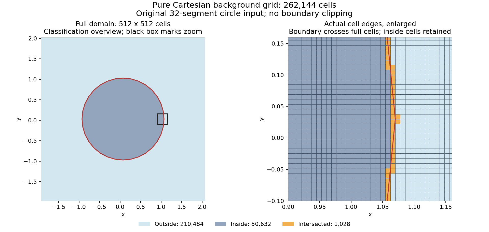

# CartMesh2D

原生二维网格生成与不可压层流 CFD 工具，提供 macOS、Windows、Linux 桌面应用和命令行接口。导入二维轮廓或图片，生成纯笛卡尔背景、Cut-cell 或共形边界层网格，查看质量并导出；有效流体网格可继续进行原生有限体积计算。

当前源码版本 **0.4.40**，定位为**有明确支持范围的工程验证版**。运行包、当前验证结果和未完成问题统一记录在[当前状态](docs/CURRENT_STATE_CN.md)。

[桌面使用](docs/DESKTOP_APP_CN.md) · [构建与开发](docs/DEVELOPMENT_CN.md) · [开发规则](AGENTS.md)

## 能做什么

| 功能 | 范围 |
| --- | --- |
| 纯笛卡尔背景 | 均匀或四叉树自适应；保留模型内外及相交的完整单元，输出分类 JSON/VTK/PNG；当前不接入绕流 CFD |
| Cut-cell | 原生二维流体多边形、内外流、共享面拓扑、质量检查、CM2D/VTK/OpenFOAM 导出 |
| 共形边界层（Beta） | 壁面四边形层与笛卡尔余域连接；复杂尖角、窄缝和层终止仍有支持边界 |
| 不可压层流 | 稳态及非定常、命名边界、速度/运动学压力、守恒与残差、检查点续算 |
| 数值控制 | 可选自适应线性精度、Anderson 稳态加速、压力预条件；macOS 可选系统稀疏 Cholesky |
| 被动热输运 | 恒物性温度或标量、与流动同步推进及联合续算；无浮力、辐射或双向热耦合 |
| 桌面流程 | XY/CSV/TXT/SVG/DXF/PNG/JPG 输入、实际尺度标定、预览、取消、工况保存、结果 ZIP |

main 保留参与构建和测试的实验 Euler/SST 代码，其资格与上述层流功能分开。本 worktree 的 `codex/compressible-flow` 按用户授权独立推进 Euler：新增可选 HLLC/HLLE、受限二阶、总能量耦合的恒系数 Fourier 导热及实际桌面入口，数值证据和未完成项以 [当前状态](docs/CURRENT_STATE_CN.md) 为准；未合入 main。

## 下载与启动

在 [desktop-platforms 构建列表](https://github.com/wuhahaTWT/cartesian-mesh-generator-2d/actions/workflows/desktop-platforms.yml)选择**全部成功、版本匹配**的运行，下载对应 Artifacts。附件需要 GitHub 登录且有保留期限；过期时从源码构建。不要将旧版本包当作当前版本验收。

| 平台 | 附件 | 启动文件 |
| --- | --- | --- |
| macOS Apple Silicon | `CartMesh2D-mac-arm64` | `CartMesh2D.app` |
| Windows x64 | `CartMesh2D-win-x64` | `CartMesh2D.exe` |
| Linux x64 | `CartMesh2D-linux-x64` | `cartmesh2d-desktop` |

展开外层附件后，再解压其中应用 ZIP 或 tar.gz，保留整个应用目录。包自带 Electron、原生程序、样例和中文字体，运行不需要 Node.js、Python 或编译器。Linux 需要桌面系统库。包未签名/公证；本地 macOS 构建与 CI 构建的最低系统版本可能不同，见[平台记录](docs/CURRENT_STATE_CN.md#验证与运行包)。OpenFOAM 需另行安装。

已有本地构建时使用 `打开CartMesh2D.command`、`start-windows.cmd` 或 `start-linux.sh`。

## 快速使用

1. 导入轮廓或选择样例；图片先确认轮廓并标定实际宽度。
2. 选择生成方法与内外流语义，再设置数量或相对尺寸。闭合轮廓默认表示固体。
3. 生成预览，检查实际单元数、质量和失败说明。数量增加不能替代网格无关性验证。
4. 有效流体网格可设置层流工况并计算；背景网格只做几何分类。达到迭代上限不等于收敛。
5. 导出 ZIP，先阅读包内 `README_CN.md`；续算使用完整检查点，不能把失败候选场当成已接受状态。

详细参数、温度、非定常、命名边界和导出步骤见[桌面使用指南](docs/DESKTOP_APP_CN.md)。

## 实际规模与限制

- **262,144格完整背景网格**：512×512，内部50,632格仍保留；一次生成和JSON/VTK导出约1.46秒。这是网格生成耗时，不是CFD。[证据](artifacts/current/background-cartesian-grid.json)
- **102,017格曲壁喷管层流**：同精度、自身实现前后完整CFD成本840.87→411.37秒，约2.04倍；含共同网格生成约1.92倍。粗细映射仍是研究流程，尚非App自动功能，也没有该喷管的绝对物理精度认证。[证据](artifacts/current/native-laminar-gradient-cache.json)
- **圆环仍未达标**：原细圆环压力L2约2.776%；另一个修复研究网格为0.564%，仍高于0.5%门限。默认四次压力校正的稳定性仍待修复，研究阻尼未进入发布求解器。[证据](artifacts/current/native-annulus-repaired-research.json)



以上均为指定输入与本机观测；拓扑、Solver质量、外部checkMesh、离散方程收敛和物理精度分别报告。更完整的限制与研究状态见[当前状态](docs/CURRENT_STATE_CN.md#已知限制与继续工作)。

## 从源码构建

依赖 C++20 编译器、CMake 3.20+、Node.js 22、Python 3。macOS 使用系统 clang，Windows 使用 Visual Studio 2022 C++ 工作负载和 Windows SDK，Linux 使用 GCC 11+ 或兼容 Clang。

```sh
npm ci --prefix desktop
npm --prefix desktop run build:native
cmake --build build --config Release --parallel 2
ctest --test-dir build -C Release --output-on-failure
npm test --prefix desktop
```

按当前系统选择 `npm --prefix desktop run pack:mac`、`pack:win` 或 `pack:linux`；输出位于 `desktop/dist/`。开发运行用 `npm --prefix desktop start`。须在目标平台构建，不能混装其他系统的原生程序。

## 仓库维护

`main` 用于通过验证的集成版本，`codex/cfd-development` 用于后续开发；`codex/mesh-maintenance` 保留网格维护线，`mesher-v0.3.0` 保留加入CFD前的固定里程碑。实际集成进度见当前状态。

当前文档只有 README、AGENTS 和 `docs/` 中三份。旧阶段过程从 Git 历史查找；代表网格、数值证据和失败记录不会因文档整理而被当作无用代码删除。历史展示素材见[展示说明](展示素材/展示说明.md)。
