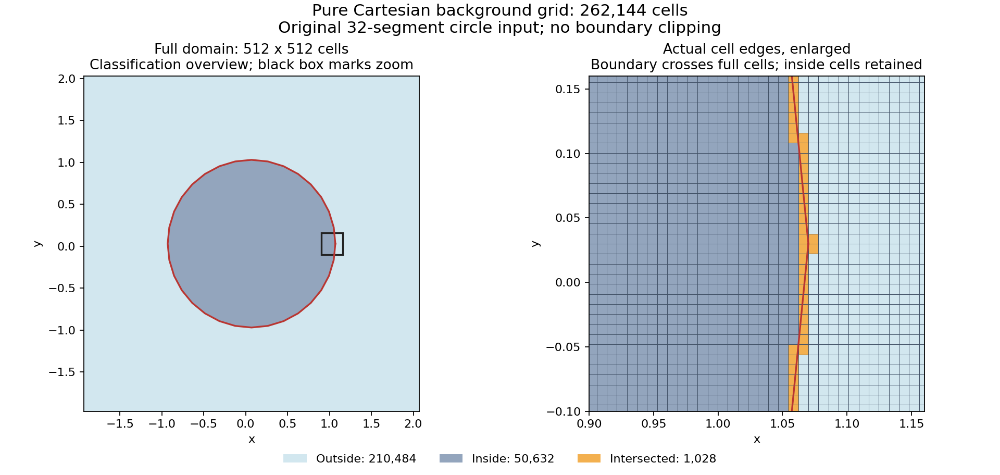

# CartMesh2D

原生二维网格生成与 CFD 工具，提供 macOS、Windows、Linux 桌面应用和命令行入口。导入轮廓或图片后，可生成网格、检查质量、计算支持范围内的流动并导出结果。

可压层流、纯笛卡尔 CFD 和流道拓扑优化已合入 `main`。它们的成熟度不同，**合并完成不代表所有物理精度问题都已解决**；版本、验证结果和待办统一见[当前状态](docs/CURRENT_STATE_CN.md)。

## 功能与入口

| 功能 | 怎么用 | 当前范围 |
| --- | --- | --- |
| Cut-cell 与共形边界层网格 | 桌面 / CLI | 原生二维内外流网格、共享面拓扑、质量检查与导出；复杂窄缝和层终止仍有限制 |
| 完整笛卡尔背景网格 | 桌面 / CLI | 均匀或自适应，保留模型内外全部方格；只做几何分类 |
| 不可压层流与被动温度 | 桌面 / CLI | 稳态、非定常、命名边界、守恒检查及续算；温度不反馈流动 |
| 可压层流（开发版） | 桌面“可压流动（试验）” / CLI | 理想气体、恒物性黏性与导热，可选二阶格式和二次壁面重构 |
| 纯笛卡尔 CFD（实验版） | `cartmesh2d_immersed_cli` | 独立浸入边界求解器，当前为静止物体的周期压差通道 |
| 流道拓扑优化（研究工具） | `tools/optimization/` | 自动设计流道连接，再提取真实壁面并用 Cut-cell CFD 复算 |

背景网格不能直接送入 CFD；浸入边界和拓扑优化尚无桌面入口。保留的 SST 代码不代表通用湍流资格。

## 下载与开始

在 [desktop-platforms 构建列表](https://github.com/wuhahaTWT/cartesian-mesh-generator-2d/actions/workflows/desktop-platforms.yml)选择**全部成功、版本匹配**的运行，下载对应附件：

| 平台 | 附件 | 启动文件 |
| --- | --- | --- |
| macOS Apple Silicon | `CartMesh2D-mac-arm64` | `CartMesh2D.app` |
| Windows x64 | `CartMesh2D-win-x64` | `CartMesh2D.exe` |
| Linux x64 | `CartMesh2D-linux-x64` | `cartmesh2d-desktop` |

附件需要 GitHub 登录且有保留期限。解压外层附件及其中的应用包，保留整个应用目录；包自带运行程序与样例，无需安装开发工具。当前包未签名，平台要求见[桌面使用](docs/DESKTOP_APP_CN.md#打开与版本)。过期附件可按[开发指南](docs/DEVELOPMENT_CN.md#构建与有限验证)从源码构建。

1. 导入轮廓或选择样例；图片先确认红线并标定实际宽度。
2. 选择网格方法和内外流语义，设置数量或尺寸，生成预览。
3. 检查质量及失败说明；有效流体网格可继续设置工况并计算。
4. 导出 ZIP，阅读包内 `README_CN.md`；需要续算时保留完整检查点。

图中为已生成的 262,144 格背景网格，展示完整方格与几何分类；规模和性能证据见[当前状态](docs/CURRENT_STATE_CN.md#已验证的规模和性能)。

## 文档与维护

| 文档 | 查什么 |
| --- | --- |
| [当前状态](docs/CURRENT_STATE_CN.md) | 现在做到哪里、验证过什么、下一步做什么 |
| [桌面使用](docs/DESKTOP_APP_CN.md) | 安装、操作、参数、导出与续算 |
| [开发指南](docs/DEVELOPMENT_CN.md) | 构建、代码入口、算法与复现命令、历史展示素材 |
| [开发规则](AGENTS.md) | 修改代码和交付时必须遵守的约束 |

长期只保留 `main`（已验证集成）和 `codex/cfd-development`（后续开发）。已完成分支的提交保留在 Git 历史中；固定网格里程碑 `mesher-v0.3.0` 不移动。实验输入、真实场和失败记录按[保留规则](docs/CURRENT_STATE_CN.md#工作区与证据保留)保存。
